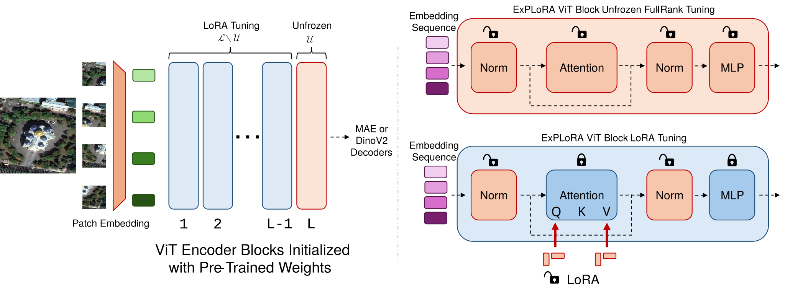

# ExPLoRA (ICML 2025)
**[Website](https://samar-khanna.github.io/ExPLoRA/)** | 
**[Paper](https://arxiv.org/abs/2406.10973)** |
**[Video](https://slideslive.com/39039614)**  |
**[🤗 Checkpoints](https://huggingface.co/samarkhanna/ExPLoRA)**

This is the official repository for the ICML 2025 paper 
"_ExPLoRA: Parameter-Efficient Extended Pre-training to Adapt Vision Transformers under Domain Shifts_".  

Authors: 
[Samar Khanna](https://samar-khanna.github.io) <sup>1</sup>, 
[Medhanie Irgau](https://scholar.google.com/citations?user=WZ-NhOkAAAAJ), 
[David B. Lobell](https://earth.stanford.edu/people/david-lobell#gs.5vndff), 
[Stefano Ermon](https://cs.stanford.edu/~ermon/).

## Overview

ExPLoRA is a parameter-efficient method for adapting pre-trained Vision Transformers (ViT) to new domains using LoRA-based extended pre-training. Instead of training the full architecture, ExPLoRA freezes most of the backbone and trains low-rank adapters and a small subset of ViT blocks during self-supervised pre-training on target domain data.

<p align="center">
  
</p>


## Setup
We have provided a `requirements.txt` file which you can use with `pip`.
```
conda create -n explora python=3.10
pip install -r requirements.txt
```

## Code Structure
This repository is organized via self-contained directories as follows:
- `dinov2/`: ExPLoRA self-supervised pre-training with DINOv2.
- `mae/`: ExPLoRA self-supervised pre-training with MAE.
- `finetune/`: LoRA or full fine-tuning of pre-trained checkpoints on supervised downstream datasets.
- `linprobe/`: Linear probing or KNN of pre-trained checkpoints on supervised downstream datasets.
- `scripts/`: Example shell scripts to run pre-training and fine-tuning.

We suggest creating a `data_and_checkpoints/` directory in the repository.
You can store model initialization weights and other checkpoints or data `.csv` files here.

NOTE: This repository contains code to run pre-training with two fairly different self-supervised methods-- DinoV2 and MAE. 
To keep things readable and amenable for further research, we have created self-contained directories for `dinov2`, `mae`, `finetune` and `linprobe`. 
This comes at the expense of code repetition. As one example, you will find repeated definitions of image datasets like `CustomDatasetFromImages`. 
This has been done so intentionally.

## Usage
The `scripts/` directory contains example scripts for pre-training with ExPLoRA and fine-tuning of pre-trained checkpoints.
- **DinoV2 ExPLoRA Pre-training (RGB):** `scripts/pretrain_dino.sh`
- **MAE ExPLoRA Pre-training (RGB):** `scripts/pretrain_mae.sh`
- **MAE ExPLoRA Pre-training (Multi-spectral):** `scripts/pretrain_mae_group_channel.sh`
- **MAE ExPLoRA Pre-training (Temporal):** `scripts/pretrain_mae_temporal.sh`
- **Fine-tuning (RGB):** `scripts/finetune.sh`
- **Fine-tuning (Multi-spectral):** `scripts/finetune_group_channel.sh`
- **Fine-tuning (Temporal):** `scripts/finetune_temporal.sh`
- **Linear probing (RGB):** `scripts/linprobe.sh`
- **KNN (RGB):** `scripts/knn.sh`

Please see the scripts for details on the arguments.

## Initialization Checkpoints
ExPLoRA relies on model weights from DinoV2 and MAE as an initialization to begin extended pre-training.
We have organized them here for your convenience.

| Model          | ViT-B | ViT-L | ViT-G |
|----------------|:---:|:---:|:---:|
| DinoV2         | [ViT-B/14](https://dl.fbaipublicfiles.com/dinov2/dinov2_vitb14/dinov2_vitb14_pretrain.pth) | [ViT-L/14](https://dl.fbaipublicfiles.com/dinov2/dinov2_vitl14/dinov2_vitl14_pretrain.pth) | [ViT-G/14](https://dl.fbaipublicfiles.com/dinov2/dinov2_vitg14/dinov2_vitg14_pretrain.pth) |
| MAE (pixel)    | [ViT-B/16](https://dl.fbaipublicfiles.com/mae/visualize/mae_visualize_vit_base.pth) | [ViT-L/16](https://dl.fbaipublicfiles.com/mae/visualize/mae_visualize_vit_large.pth) | N/A |
| MAE            | [ViT-B/16](https://dl.fbaipublicfiles.com/mae/pretrain/mae_pretrain_vit_base.pth) | [ViT-L/16](https://dl.fbaipublicfiles.com/mae/pretrain/mae_pretrain_vit_large.pth) | N/A |

MAE (pixel) refers to MAE models trained without `norm_pix_loss`.
This means they are trained to reconstruct directly in pixel space.

Note that DinoV2 checkpoints don't contain the pre-trained Dino heads, so we must initialize them from scratch during ExPLoRA.
On the other hand, MAE checkpoints do contain the pre-trained decoders which are part of the initialization during ExPLoRA.

## ExPLoRA Checkpoints
Pre-trained ExPLoRA checkpoints are available on 🤗 **[Hugging Face](https://huggingface.co/samarkhanna/ExPLoRA)**.

### DinoV2 + ExPLoRA (fMoW RGB)

| Description | ViT-B | ViT-L |
|-------------|:-----:|:-----:|
| DinoV2 teacher weights + ExPLoRA adapters | [ViT-B/14](https://huggingface.co/samarkhanna/ExPLoRA/resolve/main/explora_dinov2_fmow_rgb/explora_dinov2_vit_base_fmow_rgb.pth) | [ViT-L/14](https://huggingface.co/samarkhanna/ExPLoRA/resolve/main/explora_dinov2_fmow_rgb/explora_dinov2_vit_large_fmow_rgb.pth) |
| Encoder-only weights | [ViT-B/14](https://huggingface.co/samarkhanna/ExPLoRA/resolve/main/explora_dinov2_fmow_rgb/explora_dinov2_vit_base_fmow_rgb_encoder_only.pth) | [ViT-L/14](https://huggingface.co/samarkhanna/ExPLoRA/resolve/main/explora_dinov2_fmow_rgb/explora_dinov2_vit_large_fmow_rgb_encoder_only.pth) |

### MAE + ExPLoRA (fMoW Sentinel Multispectral)

| Description | ViT-L |
|-------------|:-----:|
| MAE encoder & decoder weights + ExPLoRA adapters | [ViT-L/16](https://huggingface.co/samarkhanna/ExPLoRA/resolve/main/explora_mae_multispectral/explora_mae_fmow_sentinel.pth) |
| Encoder-only weights | [ViT-L/16](https://huggingface.co/samarkhanna/ExPLoRA/resolve/main/explora_mae_multispectral/explora_mae_fmow_sentinel_encoder_only.pth) |


> **Note:** All checkpoints have LoRA adapters **already merged** into the weights. The full checkpoints retain the separate `q_proj`, `k_proj`, `v_proj` layers (with merged LoRA) alongside the combined `qkv` weights for reference. The encoder-only checkpoints contain just the merged `qkv` weights, ready for downstream use.

## Acknowledgements
Code from this repository borrows from the amazing contributions to the [DinoV2](https://github.com/facebookresearch/dinov2), [MAE](https://github.com/facebookresearch/mae), and [SatMAE](https://github.com/sustainlab-group/SatMAE) repositories.

## Citation
If you find our project helpful, please cite our paper:
```
@inproceedings{khanna2025explora,
  title={Ex{PL}o{RA}: Parameter-Efficient Extended Pre-Training to Adapt Vision Transformers under Domain Shifts},
  author={Samar Khanna and Medhanie Irgau and David B. Lobell and Stefano Ermon},
  booktitle={Forty-second International Conference on Machine Learning},
  year={2025},
  url={https://openreview.net/forum?id=OtxLhobhwb}
}
```
